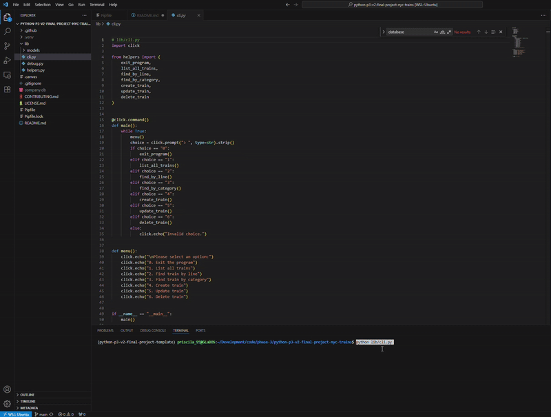

## NYC Trains CLI Project

This project is a command-line interface (CLI) for managing and exploring the data of New York City subway trains. A user can list all trains, find a train by line or category, create new trains, update, and delete existing trains. The CLI interacts with an SQLite database (`company.db`) that stores train information, including line, category, and `nycdot_id`.  

The main interface is menu-driven, allowing the user to select an action with a number. Each action guides the user to further prompts for required information, such as train line or category, for a smooth interactive experience.

---
## Table of Contents 📖

- [Project Structure](#project-structure)
- [Features](#features)
- [Models and Functions](#models-and-functions)
- [Contributing](#contributing)
- [License](#license)

--- 
## Project Structure 🏗
```console
.
└── lib
│    ├── models
│    │   ├── __init__.py
│    │   ├── nycdot.py
│    │   └── train.py
│    ├── cli.py
│    ├── debug.py
│    └── helpers.py
├── company.db
├── Pipfile
├── Pipfile.lock
└── README.md
```

---
## Features ⭐

- Menu-Driven CLI Interface: Main menu with numbered options and continuous prompts.
- List All Trains: Displays all of the trains in the database.
- Find Train by Line: Prompts user for inputting a line. Returns matching train.
- Find Train by Category: Prompts user for inputting a category. Returns all trains that match.
- Create Train: Prompts user for train details (line and category).
- Update Train: Prompts user for an existing train line and updates the line and category in the database.
- Delete Train: Prompts user for a train line and deletes the train.
- Input Validation: Makes sure user inputs the correct data before performing a operation.
- Database Integration: CRUD operations using the `Train` model with SQLite3 (`company.db`). Foreign key validation against the `nycdots` table.
- Exit Option: Exits the CLI when the user inputs option `0`.
- Helper Functions: `find_by_line()` and `find_by_category()` handle requests and formatting, keeping the CLI code clean.


---
## Models and Functions 📱
### CLI Script (`cli.py`)

The `cli.py` file is the main file that runs at the start of the application. It provides the main menu, handles user input, and calls helper functions to perform CRUD operations on trains. Below are the key features:

- Exit with option ‘0’
- Menu-driven interface for easy navigation
- Input validation (checks what the user types before using it)
- Uses the Train class to interact with the database

**Example usage:**
```console
$ python lib/cli.py
Please select an option:
0. Exit the program
1. List all trains
2. Find train by line
3. Find train by category
4. Create train
5. Update train
6. Delete train
>:
```

#### Functions

##### `main()`
Runs the main loop of the CLI, displays the menu, and routes the user’s choices to corresponding functions. It continuously prompts the user until the user chooses to exit.

##### `menu()`
Displays the numbered list of actions available in the CLI.

##### Option Handlers
- `list_all_trains()`: Lists all trains in the database with their details (line, category, Nycdot ID).  
- `find_by_line()`: Prompts for a line and retrieves the corresponding train object.  
- `find_by_category()`: Prompts for a category and retrieves all train objects with matching ‘category’.  
- `create_train()`: Prompts for train details and creates a new train in the database.  
- `update_train()`: Prompts for an existing train line and updates its line and category.  
- `delete_train()`: Prompts for a train line and deletes the indicated train from the database.  
- `exit_program()`: Exits the CLI.

---

## Helper Functions (`helpers.py`)

This file contains functions that aid in the CLI operations, including input handling, validation, and formatting. Each function is designed to keep the CLI code focused on the user’s interaction. Examples include:

- `find_by_line()`: Selects the `Train.find_by_line` method and prints the results.  
- `find_by_category()`: Selects the `Train.find_by_category` method and prints queries.  

---
### Models 
#### `train.py`

The `Train` model represents the trains table in the database and handles all of the database interactions. `train.py` represents a subway train. It handles the database interactions such as creating, updating, and deleting train records.

#### Functions: 
- `create(line, category, nycdot_id=None)`: Adds a new train to the database.
- `update()`: Updates the current train instance in the database.
- `save()`: Saves a new train instance to the database.
- `find_by_line(line)`: Returns all trains with a given line.
- `find_by_category(category)`: Returns all trains with a given category.

#### `nycdot.py`
This model represents the NYC Department of Transportation (NYCDOT). It is used to validate foreign key references from the Train objects.

#### Key Function:
- `find_by_id(id)`: Checks if an NYCDOT record exists in the database for a given ID.

#### Properties

- `nycdot_id`: Verifies that the value references a valid `Nycdot` in the database, making sure the foreign key column exists in the related table.  

---
### Database

The project uses SQLite (`company.db`) with two main tables:

- `trains`: Stores train line, category, and `nycdot_id`.  
- `nycdots`: Stores `nycdot` data that is referenced (must exist before creating a train).  

Foreign key constraints make sure the `nycdot_id` and the `trains` table points to a valid record in the nycdots table.  

---
## Contributing 🤝
1. Clone the repository:
`Git clone <your-repo-ssh>`
2. Set up your virtual environment:
`pipenv install`
`pipenv shell`
3. Launch the SQLite3 to get a visual representation of the tables:
`sqlite3 company.db`
4. Run the CLI:
`python lib/cli.py`


Happy coding!

---
## Resources 📚

- [Python Official Documentation](https://docs.python.org/3/)
- [SQLite Documentation](https://www.sqlite.org/docs.html)
- [Click Documentation](https://click.palletsprojects.com/)

---
## License

[](https://choosealicense.com/licenses/mit/)
