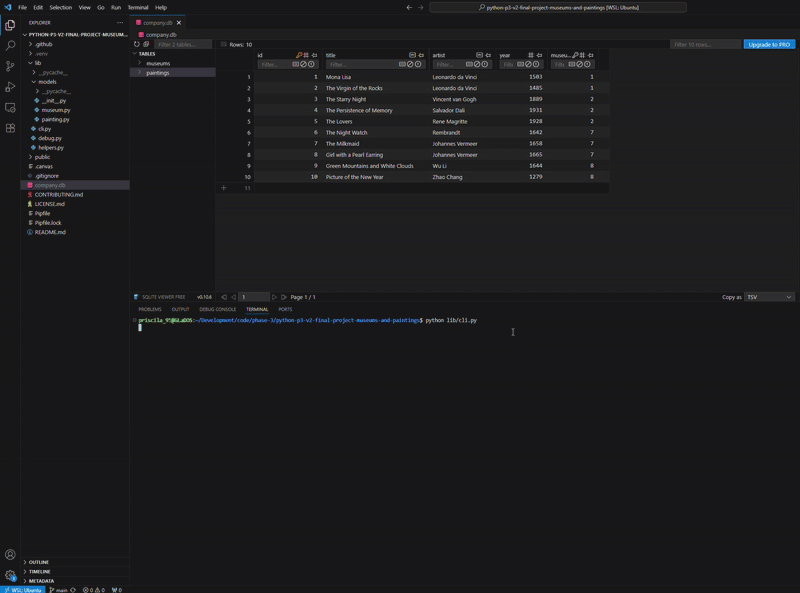

## Museums & Paintings CLI Project

This project is a command-line interface (CLI) for managing and exploring museums and their paintings. A user can list all museums, view the paintings in each museum, find museums or paintings, create new museums and paintings, update existing records, and delete entries. The CLI interacts with an SQLite database (company.db) that stores museum and painting information, including museum details (name, location) and painting details (title, artist, year).

A user can use this project to keep a personal record of paintings in different museums or if the user is an artist, they can use this CLI to keep track of where their works of art are located.

The main interface is menu-driven, allowing the user to select actions with a number. Each action guides the user through further prompts for required information, providing a smooth interactive experience.

--- 

## Table of Contents 📖
- [Project Structure](#project-structure)
- [Features](#features)
- [Models and Functions](#models-and-functions)
- [Contributing](#contributing)
- [License](#license)

--- 

## Project Structure 🏗
```console
.
└── lib
│    ├── models
│    │   ├── __init__.py
│    │   ├── museum.py
│    │   └── painting.py
│    ├── cli.py
│    ├── debug.py
│    └── helpers.py
├── company.db
├── Pipfile
├── Pipfile.lock
└── README.md
```

---

## Features ⭐

- Menu-Driven CLI Interface: Main menu with numbered options and continuous prompts.
- List All Museums: Displays all museums in the database.
- View Paintings in a Museum: Lists all paintings for a selected museum.
- Navigate Back: Allows user to input B or b at any menu to return to the previous menu.
- Create Museum or Painting: Prompts user for details and adds entries to the database when user inputs A/a.
- Update Museum or Painting: Allows updating museum name, location, and painting title, artist, and year when user inputs U/u.
- Delete Museum or Painting: Prompts for deletion of selected museum or painting when user inputs D/d.
- Input Validation: Ensures user inputs valid data before performing an operation.
- Database Integration: CRUD operations using Museum and Painting models with SQLite3.
- Exit Option: Exits the CLI when the user inputs E/e.
- Helper Functions: list_paintings(), list_museums(), and other helpers streamline queries and menu interactions.



---

## Models and Functions 📱
### CLI Script (`cli.py`)

The `cli.py` file runs the main application. It provides the main menu, handles user input, and calls helper functions to perform CRUD operations on museums and paintings. Key features:
- Exit with option `E/e`
- Menu-driven interface for smooth navigation
- Input validation for all prompts
- Uses Museum and Painting classes to interact with the database

**Example usage:**
```console
$ python lib/cli.py
Please select an option: 

Type M or m to see the museums
Type E or e to exit

> m

Museums: 

1. Louvre Museum (Paris, France)
2. Metropolitan Museum of Art (New York, USA)
3. Rijksmuseum (Amsterdam, Netherlands)
4. National Palace Museum (Taipei, Taiwan)
 
Please type the number corresponding to the museum from the list to see its details
                or
Type B or b to go back to the previous menu
Type A or a to add a new museum
Type E or e to exit

> 4

Paintings at 'National Palace Museum': 

1. Green Mountains and White Clouds
2. Picture of the New Year
 
Please type the number corresponding to the painting from the list to see its details
                or
Type B or b to go back to the previous menu
Type A or a to add a new painting
Type U or u to update this museum
Type D or d to delete this museum
Type E or e to exit

> 1

Details of 'Green Mountains and White Clouds': 
Artist: Wu Li
Year: 1644
 
Options:
Type B or b to go back to the previous menu
Type U or u to update this painting
Type D or d to delete this painting
Type E or e to exit

> b

Paintings at 'National Palace Museum': 

1. Green Mountains and White Clouds
2. Picture of the New Year
 
Please type the number corresponding to the painting from the list to see its details
                or
Type B or b to go back to the previous menu
Type A or a to add a new painting
Type U or u to update this museum
Type D or d to delete this museum
Type E or e to exit

> 
```

### Functions

#### `main_menu()`
Runs the main loop of the CLI, displaying the menu and routing user input to the appropriate functions. Continuously prompts until the user exits. Allows user to:
- Select an option to view the list of museums (M/m)
- Exit the program (E/e)

#### Option Handlers
`museums_menu():` Lists all museums and allows the user to: 
- Go back to the previous menu (B/b)
- Add a new museum (A/a)
- Exit the program (E/e)

`paintings_menu(museum):` Lists all paintings in a selected museum and allows the user to:
- Go back to the previous menu (B/b)
- Add a new painting (A/a)
- Update the current museum (U/u)
- Delete the current museum (D/d)
- Exit the program (E/e)

`painting_details_menu(painting, museum):` Displays details of a painting and allows the user to:
- Go back to the previous menu (B/b)
- Update the current painting (U/u)
- Delete the current painting (D/d)
- Exit the program (E/e)

- `create_museum(), create_painting(museum):` Prompts for details and saves the new entry to the database.
- `update_museum(museum), update_painting(painting):` Prompts to update the selected museum or painting and saves the changes.
- `delete_museum(museum), delete_painting(painting):` Deletes selected record from the database.
- `exit_program():` Exits the CLI.

---

### Helper Functions (`helpers.py`)

Contains utility functions for the CLI, including input handling, validation, and formatting. Examples:
- `list_museums(), list_paintings(museum):` Retrieves museums/paintings for a museum/painting and formats them for display.
- Input validation functions to ensure correct data types and ranges for year or names.

---

### Models 
#### `museum.py`
Represents museums in the database and handles all interactions:
- create(name, location): Creates a new museum.
- update(name=None, location=None): Updates a museum’s attributes.
- delete(): Deletes a museum and its related paintings.
- get_all(): Returns all museums.
- find_by_id(id): Returns a museum by id.

#### `painting.py`
Represents paintings in the database and handles CRUD operations:
- create(title, artist, year, museum): Adds a painting.
- update(title=None, artist=None, year=None): Updates the painting.
- delete(): Deletes the painting.
- get_all(): Returns all paintings.
- find_by_id(id): Returns a painting by id.
- find_by_museum(museum_id): Returns all paintings for a specific museum.

#### Key Functions: 🔑
`Museum`
- `find_by_id(id):` Returns a Museum object corresponding to the table row matching the specified primary key. Useful for validating museum relationships when assigning paintings.

`Painting`
- `find_by_museum(museum_id):` Returns a list of Painting objects belonging to the specified museum. This is how the CLI lists all paintings for a museum.

##### Properties:
`Museum`
- `name:` The name of the museum (string). Must be a non-empty string.
- `location:` The location where the museum is located (string). Must be a non-empty string.

`Painting`
- title: Title of the painting (string). Non-empty.
- artist: Artist of the painting (string). Non-empty.
- year: Year the painting was created (integer, year must be between 1000 and current year).
- museum: The associated Museum object. Must be a saved Museum instance.

---

### Database

The project uses SQLite (company.db) with two main tables:
- `museums:` Stores museum name and location.
- `paintings:` Stores painting title, artist, year, and a foreign key `museum_id` referencing `museums(id)`.

Foreign key constraints ensure that paintings are always linked to a valid museum. Deleting a museum also deletes all associated paintings due to foreign key constraints. Deleting a painting only removes that painting’s record.

---

## Contributing 🤝
1. Clone the repository:
`Git clone <git@github.com:P-RF/python-p3-v2-final-project-museums-and-paintings.git>`
2. Set up your virtual environment:
`pipenv install`
`pipenv shell`
3. Launch the SQLite3 to get a visual representation of the tables:
`sqlite3 company.db`
4. Run the CLI:
`python lib/cli.py`


Happy coding!

---

## Resources 📚

- [Python Official Documentation](https://docs.python.org/3/)
- [SQLite Documentation](https://www.sqlite.org/docs.html)
- [Click Documentation](https://click.palletsprojects.com/)

---

## License

[](https://choosealicense.com/licenses/mit/)
